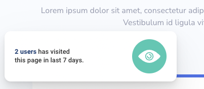

# Problem

We are tracking user events, such as conversions (customer bought something) on our customers' sites and they are saved to the events table, this content is available in [data.json](data.json). A random car manufacturer called `mycompany` (`organization_id`) is using Trustmary to track conversions on their site. They want to show their customers how many persons have have been thinking about buying (type=`page_view`) and how many have bought (type=`conversion`) a car (path=`/car/:car_id`).

Create a simple React app with Typescript that can display the component based on input props. It is up to you how you will demonstrate the component. The site does not need any other content than the component.

This is an example of what the customer might expect to see, you can do your own design:

Here you can see it live https://demo.trustmary.io/page-visitor-notification/.

_Extras_:

- For a good looking design
- Show only events that have occured in the last 7 days
- Tests
- What would be the next steps?

# How to submit

Create a private repository to Github, when you are ready add `@infr` (Kim Salmi) to the repository (Settings -> Collaborators) and send us an email.
